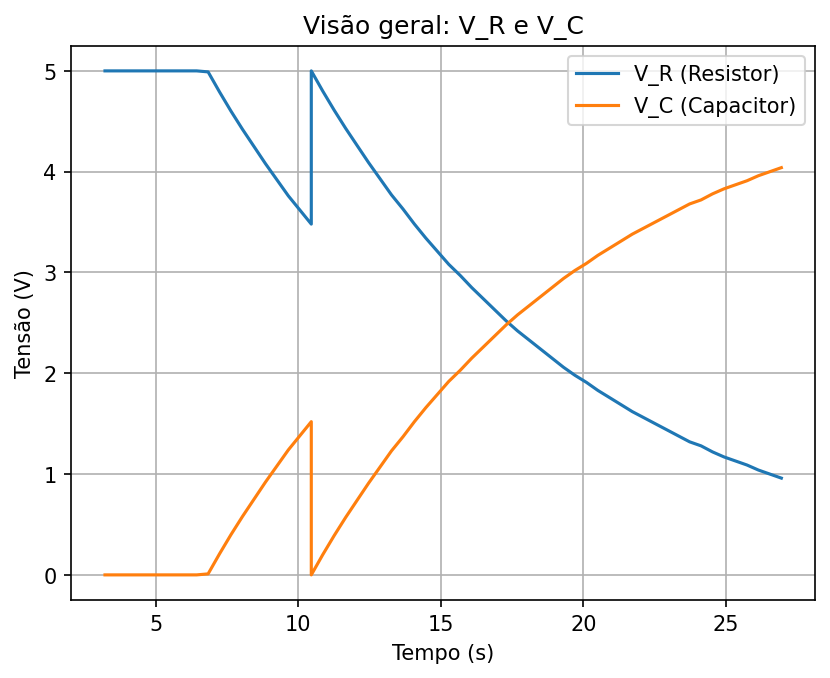
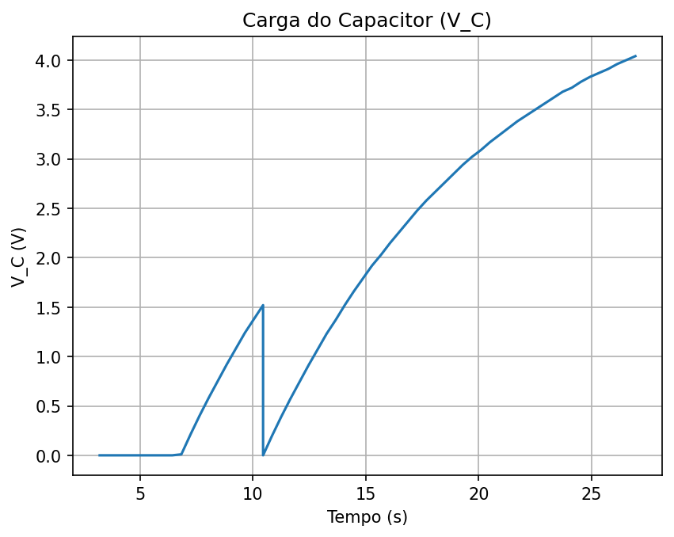
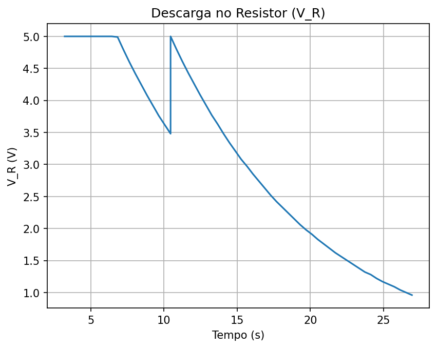
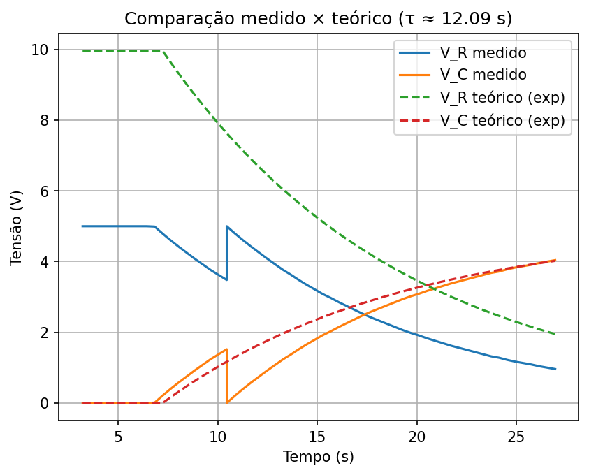
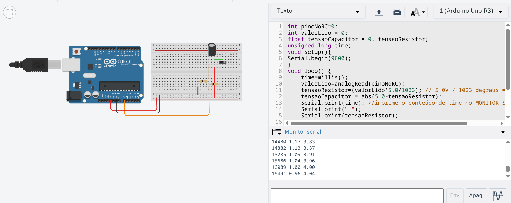

## Circuito RC — Resultados

Resultados obtidos a partir dos dados do Monitor Serial para o circuito RC. As figuras abaixo (armazenadas em `assets/`) foram geradas pelo notebook `codigoPython.ipynb`.

### Resumo

- Tensão de referência: ~5 V
- Constante de tempo estimada (a partir de V_R): τ ≈ 12,09 s
- Comportamento observado:
  - V_C cresce exponencialmente (carga) até se aproximar de 5 V
  - V_R decai exponencialmente (descarga), complementar a V_C
  - As curvas medidas condizem com o modelo teórico de um circuito RC

### Visão geral — V_R e V_C

### Carga do Capacitor (V_C)

### Descarga no Resistor (V_R)

### Comparação medido × teórico

As curvas teóricas (exponenciais) com τ ≈ 12,09 s acompanham bem os dados medidos; diferenças pequenas podem decorrer de tolerâncias de R e C, discretização do tempo e ruído de leitura.

### Extras

- Esquemático: [`assets/esquematico.pdf`](assets/esquematico.pdf)
- Amostra do Monitor Serial: 
