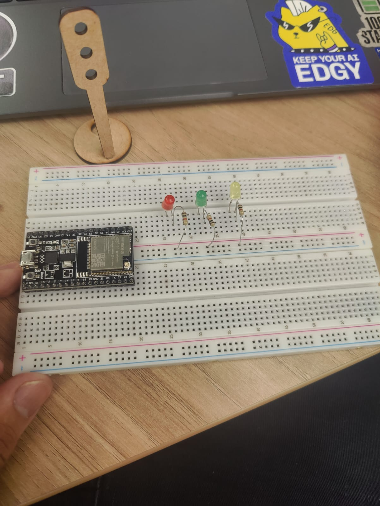
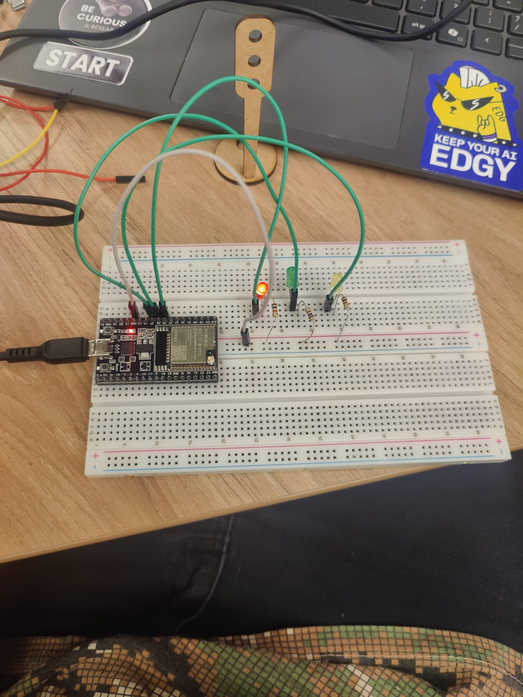
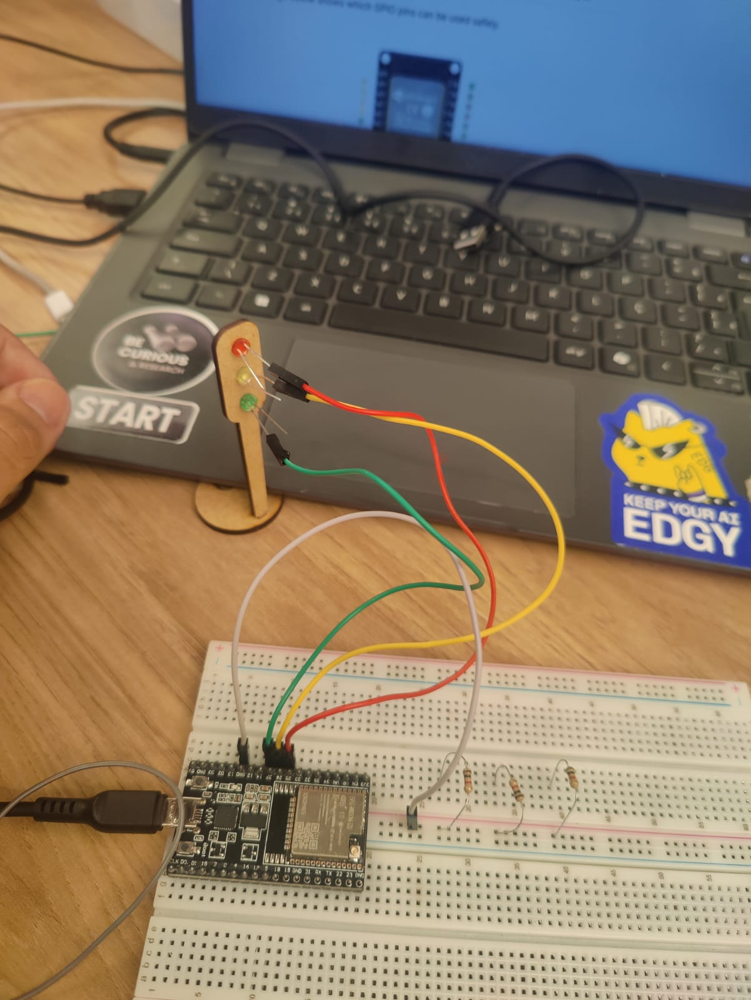
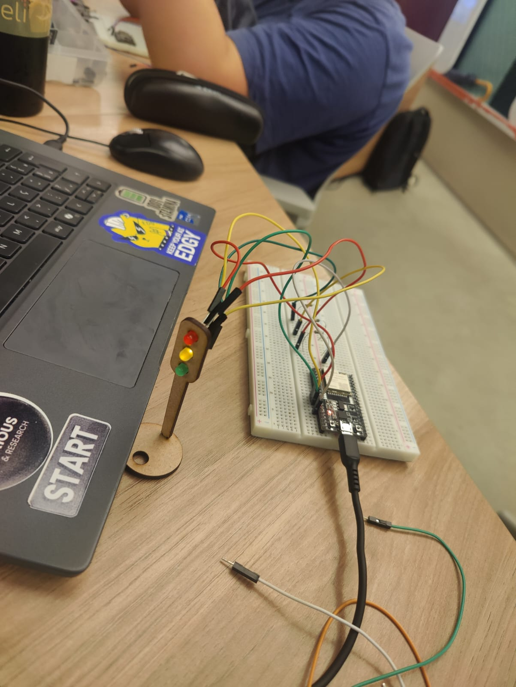

# Semáforo Offline

Atividade: Semáforo Offline — montagem física e programação de um semáforo simples usando LEDs.

Este repositório contém o código e instruções para montar um semáforo offline que
simula as luzes vermelho, verde e amarelo, seguindo os tempos especificados:

- 6 segundos no vermelho
- 4 segundos no verde
- 2 segundos no amarelo

O objetivo é montar o circuito em uma protoboard, proteger os LEDs com resistores,
e carregar o código (ex.: ESP32 ou outra placa compatível com a IDE Arduino) para
controlar a sequência de luzes. O código usa ponteiros para demonstrar manipulação
simples de memória (veja `codigo.ino`).

## Estrutura do repositório

- `codigo.ino` — código principal do semáforo (exemplo com ponteiro para o estado).
- `readme.md` — este arquivo, instruções de montagem e testes.

## Lista de materiais

- 1 x placa microcontroladora (ESP32)
- 1 x protoboard
- 3 x LEDs: vermelho, amarelo, verde
- 3 x resistores
- Jumpers (fios)
- Fonte USB para alimentar a placa

Observação: as pins usadas no `codigo.ino` são 25, 26 e 27 (comuns em ESP32). Se
você estiver usando um Arduino Uno (que não tem pinos 25-27), ajuste os números de
pino no arquivo `codigo.ino` para pinos digitais disponíveis (ex.: 8, 9, 10).

## Diagrama de ligação (básico)

Conectar cada LED com seu resistor em série entre o pino digital e o terminal do LED.
O catodo do LED vai ao GND. Exemplo de tabela de ligação (conforme `codigo.ino`):

- PIN_RED (25) -> LED vermelho -> 220Ω -> GND
- PIN_YELLOW (26) -> LED amarelo -> 220Ω -> GND
- PIN_GREEN (27) -> LED verde -> 220Ω -> GND

Se usar uma placa diferente, substitua os pinos no código conforme necessário.

## Explicação do código (`codigo.ino`)

Resumo do comportamento:

- O programa declara 3 constantes de pino (`PIN_RED`, `PIN_YELLOW`, `PIN_GREEN`).
- Usa uma variável `char cor` e um ponteiro `pCor` para demonstrar o uso de ponteiros.
- A função `setLightsFromChar(char* p)` ativa apenas o LED correspondente ao
  caractere ('R', 'G' ou 'Y') e desliga os demais.
- No `loop()` o estado é alterado em sequência: 'R' (6s), 'G' (4s), 'Y' (2s) —
  repetindo indefinidamente.

Pontos importantes no código:

- `Serial.begin(115200)` — usado para depuração e imprimir o estado atual no monitor serial.
- `pinMode(..., OUTPUT)` — configura os pinos como saída.
- `digitalWrite(PIN, HIGH/LOW)` — acende/apaga os LEDs.

O uso de ponteiros aqui é didático: `pCor` aponta para `cor` e é passado para a
função `setLightsFromChar`, que déréfere o ponteiro para decidir qual LED ligar.

## Como carregar o código

1. Abra a IDE Arduino ou PlatformIO.
2. Selecione a placa correta (por exemplo, ESP32 Dev Module) e a porta serial.
3. Abra `codigo.ino` e faça upload.
4. Abra o Monitor Serial com baud 115200 para ver os estados sendo impressos.

Observação para Arduino Uno: substitua os pinos 25/26/27 por outros disponíveis e
garanta que a fonte esteja adequada.

## Passo a passo

### Primeira etapa

Pimeiro eu coloquei o Esp 32, os Led e Resistores.

Colquei os leds primeiro na protoboard para testar e depois passar pra modelagem do semáforo.

Colquei os leds primeiro na protoboard para testar e depois passar pra modelagem do semáforo.

### Segunda etapa

Pimeiro eu coloquei o Esp 32, os Led e Resistores 

Liguei os jumpers e testei!!

### Terceira etapa

Liguei cada led em seus respectivos GPIO

### Quarta etapa

Liguei um resistor em cada led

Testei e funcionou!

## Avaliação em pares

### Avaliador 1

| Avaliador | Montagem física (4) | Pontos | Temporização (3) | Pontos | Código & estrutura (3) | Pontos | Observações gerais                                                         | Total (10) |
|-----------|----------------------|--------|-------------------|--------|------------------------|--------|----------------------------------------------------------------------------|------------|
| Amanda Cristina Martinez da Rosa    | Contempla parcialmente | 3.5    | Contempla          | 3.0    | Contempla               | 3.0    | Semáforo funcionou bem e conseguiu implementar um elemento a mais na montagem | 9.5        |

### Avaliador 2

| Avaliador | Montagem física (4) | Pontos | Temporização (3) | Pontos | Código & estrutura (3) | Pontos | Observações gerais                                                         | Total (10) |
|-----------|----------------------|--------|-------------------|--------|------------------------|--------|----------------------------------------------------------------------------|------------|
| Luiz     | Contempla parcialmente | 3.5    | Contempla          | 3.0    | Contempla               | 3.0    | Tudo ok, só os fios que estão um pouco bagunçado| 9.2        |

## Conclusão

Nesta atividade desenvolvi um semáforo offline desde a montagem física até a
programação da lógica de temporização. Montamos os LEDs em protoboard, protejemos
os componentes com resistores e carregamos o código em uma placa (ex.: ESP32).

O código em `codigo.ino` implementa a sequência de fases com os tempos exigidos
(6s vermelho, 4s verde, 2s amarelo) e usa um exemplo simples com ponteiros para
demonstrar manipulação de estado. Testes práticos confirmaram o funcionamento do
semáforo; caso deseje melhorias, as extensões sugeridas (botão de pedestres,
buzzer, temporização baseada em `millis()`) são bons próximos passos.

