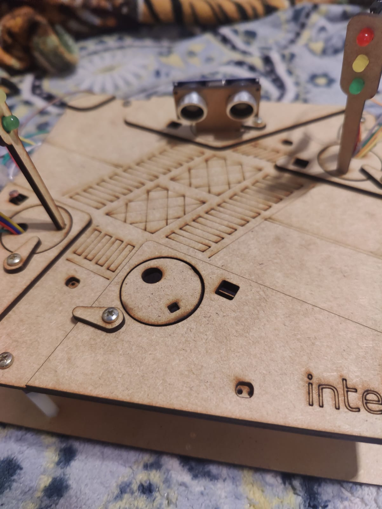
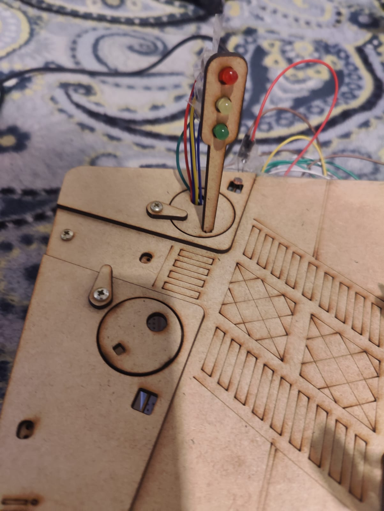
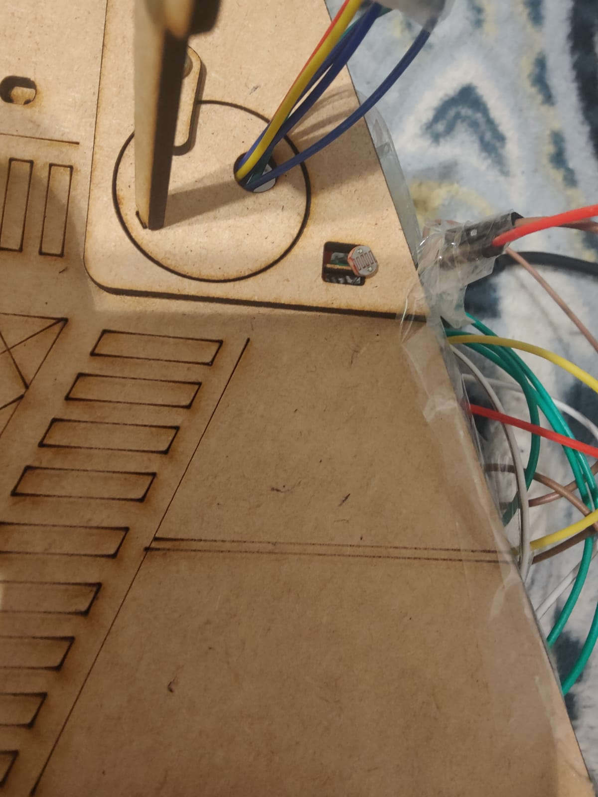
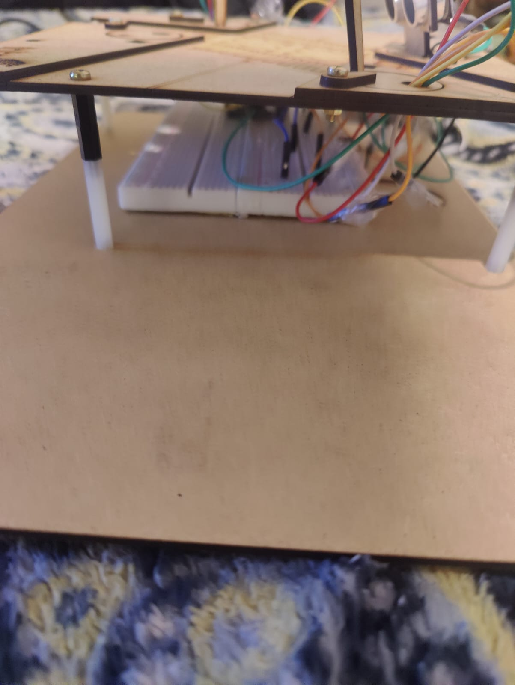

# 🚦 Semáforo Inteligente com ESP32 (Smart City)

Projeto de um semáforo inteligente para simular uma **Smart City**, usando:

- **ESP32**
- **Dois semáforos** (6 LEDs)
- **LDR** (sensor de luz)
- **Sensor ultrassônico (HC-SR04)**
- **Interface web** para monitorar e controlar o sistema

A ideia é mostrar como os semáforos podem se adaptar ao ambiente e ao fluxo de veículos, se comunicando com sensores e com uma interface online.

---

## 🧠 Lógica do Sistema

O sistema funciona em três camadas principais:

1. **Detecção de dia/noite (LDR)**  
   - LDR lê a luminosidade do ambiente.  
   - Se estiver claro → **Modo Dia**  
   - Se estiver escuro → **Modo Noturno**

2. **Detecção de veículo (Ultrassom)**  
   - O sensor ultrassônico fica apontado para onde estaria a fila de carros na via secundária.  
   - Se a distância medida for menor que um valor configurado (ex.: 20 cm), o sistema entende que **tem um carro esperando**.

3. **Interface Web (ESP32)**  
   - Página HTML simples servida pelo próprio ESP32.  
   - Mostra:
     - Valor do LDR (%)
     - Distância do ultrassom (cm)
     - Modo atual (Dia/Noite, Auto/Forçado)
   - Permite forçar:
     - **Modo AUTO** (LDR decide)
     - **Forçar MODO DIA**
     - **Forçar MODO NOTURNO**

Para acessar a interface, você deverá colocar o IP que vai ser gerado no serial monitor no seu navegador.
---

## ⚙️ Comportamento dos Semáforos

### 🌞 Modo Dia (claro)

- **Estado padrão:**
  - Semáforo 1 (via principal): **VERDE**
  - Semáforo 2 (via secundária): **VERMELHO**

- **Quando um carro é detectado (ultrassom):**
  1. Semáforo 1: **Verde → Amarelo → Vermelho**
  2. Ambos ficam **vermelhos** por um tempo de segurança
  3. Semáforo 2: **Vermelho → Verde → Amarelo → Vermelho**
  4. Volta para o estado padrão  
     (Semáforo 1 verde, Semáforo 2 vermelho)

### 🌙 Modo Noturno (escuro)

- Ambos os semáforos entram em **pisca amarelo**, indicando atenção no cruzamento:
  - Semáforo 1: amarelo piscando  
  - Semáforo 2: amarelo piscando

Esse modo pode ser ativado **automaticamente pelo LDR** ou **forçado pela interface web**.

---

## 🧩 Componentes Utilizados

- 1x **ESP32 DevKit**
- 6x **LEDs** (3 por semáforo: vermelho, amarelo, verde)
- 6x **resistores** para os LEDs (≈ 220 Ω / 330 Ω)
- 1x **LDR**
- 1x **resistor de 10 kΩ** (divisor de tensão com o LDR)
- 1x **sensor ultrassônico HC-SR04**
- Protoboard e jumpers
- Cabo USB para programar o ESP32

---

## 🔌 Pinagem (ESP32)

### Semáforo 1 (via principal)

- Verde  → **GPIO 14**
- Amarelo → **GPIO 12**
- Vermelho → **GPIO 13**

### Semáforo 2 (via secundária)

- Verde  → **GPIO 27**
- Amarelo → **GPIO 26**
- Vermelho → **GPIO 25**

### LDR

- LDR + resistor de 10k formando um **divisor de tensão**:
  - `3V3 → LDR → nó central → resistor 10k → GND`
  - O **nó central** vai para o pino **GPIO 34** (entrada analógica).

### Sensor Ultrassônico (HC-SR04)

- VCC  → 5V (ou 3V3, dependendo do módulo)
- GND  → GND
- TRIG → **GPIO 18**
- ECHO → **GPIO 19**  
  (idealmente com divisor de tensão para 3.3V no ECHO)

---

## 🧱 Montagem dos LEDs (Resumo)

Para **cada LED**:

- **Perna maior (ânodo)** → vai para o **GPIO** correspondente.  
- **Perna menor (cátodo)** → vai para um **resistor**.  
- Outro lado do **resistor** → vai para o **GND** (trilho de terra da protoboard).

## Fotos da montagem física.

Imagem 1:

Imagem 2:

Imagem 3:

Imagem 4:

## Vídeo do sistema funcionando:

<a href="https://drive.google.com/file/d/1qAziesMGUr8Wpw_hBF8S3AzI811IC33X/view?usp=sharing">Clique aqui para acessar o vídeo.</a>

## Código utilizado

<a href="codigo.ino">Clique aqui</a> para acessar o arquivo do código ou então vá até codigo.ino
